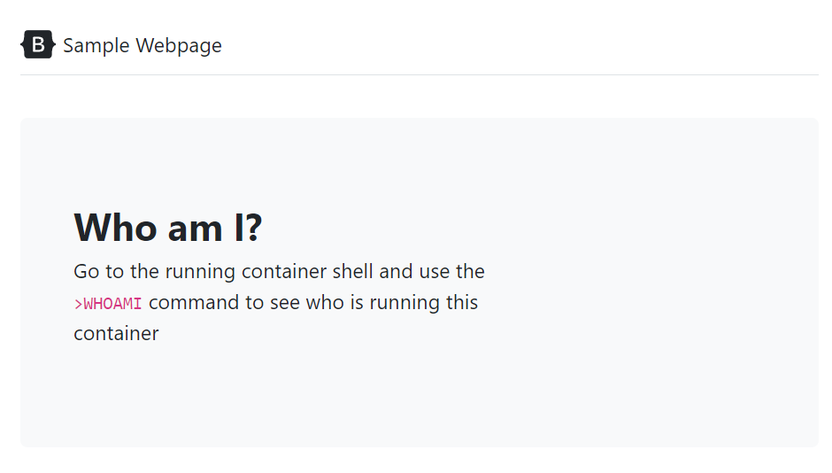

## NGINX No Root

* Sample scripts to highlight how easy it is to run an [nginx](https://www.nginx.com/) container unprivileged

### Get started

* Use the `docker-default.sh` script to run an nginx container in its default run state

* You will see the webpage below running at [localhost](http://locahost)

* In a separate command prompt use `docker-shell.sh` to login to the running container. Use the `whoami` command to see that you are running as `root`

* Close the `default-docker.sh` script and now run `docker-no-root.sh` to run the exact same container as a `USER`. 

* The same webpage will be running at [localhost](http://locahost)

* Once again use `docker-shell.sh` to login to the running container. Use the `whoami` command to see that you are a regular user!